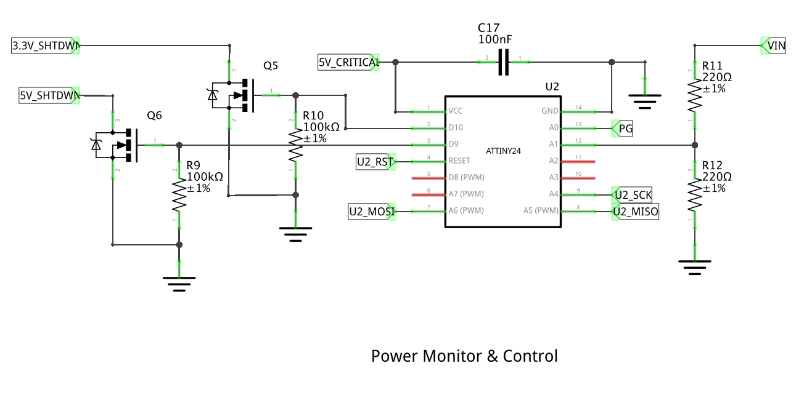

# Mainboard Power Monitor

The power monitor for the mainboard is designed with the following features:

* Safe shutdown sequence commands to Raspberry Pi.
* Shutdown interface to mainboard power supply.
* Power quality monitoring and low-voltage protection.
* Health feedback data over I2C.
* Operation mode indicator LED.

## Circuit Overview

## Bill of Materials
