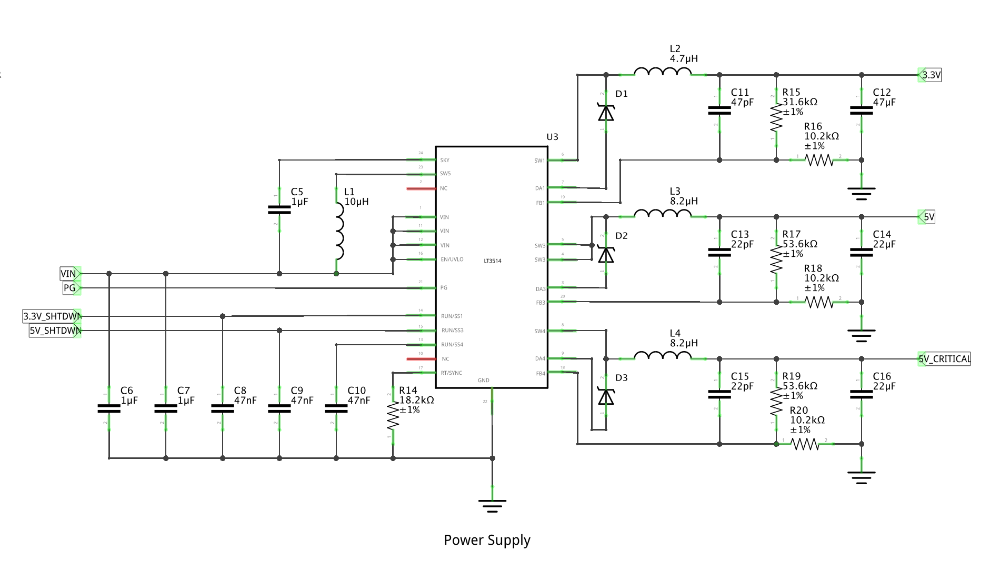

# Mainboard Power Supply

The power supply for the mainboard is designed with the following features:

* Ample current for the Raspberry Pi.
* 5V and 3.3V buses.
* Safe shutdown.
* Wide voltage input range.
* Critical power for mainboard power monitor.

## Circuit Overview



The heart of the power supply is the LT3514 Triple Step-Down Switching Regulator. It consists of three buck regulators with a single 2A channel, and two 1A channels. The device is capable of accepting voltages from 3.2V up to 36V. An on-chip boost regulator allows each channel to operate up to 100% duty cycle, minimizing the need for leveling circuitry.

The LT3514 operates robustly in fault conditions. Cycle-by-cycle peak current limit and catch diode current limit sensing protect the IC, and other mainboard components during overload conditions. Thermal shutdown protects the internal power switches at elevated temperatures. Soft-start helps control the peak inductor current during startup.

The LT3514 features output voltage tracking and sequencing, programmable frequency, programmable undervoltage lockout, and a power good pin to indicate when all ouputs are in regulation.

Channel 3 has the highest current rating, and thus will be used to supply the Raspberry Pi and 5V bus. Channel 1, at 1A, will supply the 3.3V bus. Channel 4 will supply the 5V critical bus for power monitoring and smart shutdown/startup circuitry. Channels 1 and 3 will be controlled by the power monitoring circuit. Channel 4 will always be on. By that nature, EN/UVLO will always be enabled as well to ensure constant operation.

## FB Resistor Network

The general formula for the FB resistor network is:

```
R1 = R2 * ((Vout/0.8V) - 1)
```

The datasheet states to use 1% tolerance resisitors, and that a good value for R2 is 10.2kΩ. R2 should not exceed 20kΩ to avoid bias current error.

therefore:

```
Channel 1: 1A, 3.3V
R1 = 10.2kΩ * ((3.3V/0.8V - 1) = 31875Ω ≅ 31.6kΩ

Channel 3: 2A, 5V
R1 = 10.2kΩ * ((5V/0.8V - 1) = 53550Ω ≅ 53.6kΩ

Channel 4: 1A, 5V
R1 = 10.2kΩ * [(5V/0.8V) - 1] = 53550Ω ≅ 53.6kΩ
```
conclusion:

```
R16,18,20 = 10.2kΩ @ ±1%
R15       = 31.6kΩ @ ±1%
R17,19    = 53.6kΩ @ ±1%
```

## Input Voltage Range

The minimum input voltage to regulate the output generally has to be at least 400mV greater than the greatest programmed output voltage. The only exception is when the largest output is less than 2.8V in which case the minimum is 3.2V

The absolute maximum input voltage is 40V, and the LT3514 will regulate so long as the voltage remains less than or equal to that value. However, for constant frequency operation the maximum input voltage is determined through the following formula:

```
VIN(PS) = [(VOUT + VD)/(fSW * tON(MIN)] + VSW - VD
```

where:

* `VIN(PS)` is the maximum input voltage to operate in constant frequency operation without skipping pulses.
* `VOUT` is the programmed output voltage.
* `VSW` is the switch voltage drop, at `IOUT1,4 = 1A`, `VSW1,4 = 0.4V`, at `IOUT3 = 2A`, `VSW3 = 0.4V`.
* `VD` is the catch diode forward voltage drop, for an appropriately sized diode, `VD = 0.4V`.
* `fSW` is the programmed switching frequency. As will be shown in the next section, `fSW = 1.0 MHz`.
* `tON(MIN)` is the minimum on-time, worst-case over temperature = 110ns (at T = 125ºC).

therefore:

```
VIN(PS) = [(5V + 0.4V)/(1.0 MHz * 110ns)] + 0.4V - 0.4V = 49.091V = 40V (device maximum)
VIN(PS) = [(3.3V + 0.4V)/(1.0 MHz * 110ns)] + 0.4V - 0.4V = 40.7V = 40V (device maximum)
```

conclusion:

The computed input voltage range is `5.4V < VIN < 40V`, and `VD = 0.4V`.

## Inductor Selection

```
L = 2 * (VOUT + VD)/fSW for Channels 1, 4
L = (VOUT + VD)/fSW for Channel 3
```

## Bill of Materials
