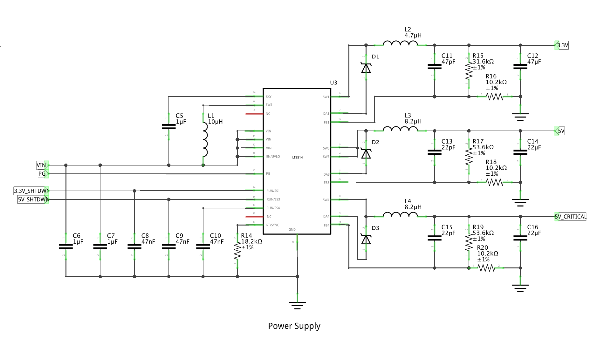

# Mainboard Power Supply

The power supply for the mainboard is designed with the following features:

* Ample current for the Raspberry Pi.
* 5V and 3.3V voltage buses.
* Safe shutdown.
* Power quality monitoring and low-voltage protection. 
* Wide voltage input range.
* Health feedback data.
* Critical power for smart shutdown/startup circuitry.

## Three Channel Switching Regulator

The heart of the power supply is the LT3514 Triple Step-Down Switching Regulator. It consists of three buck regulators with a single 2A channel, and two 1A channels. The device is capable of accepting voltages from 3.2V up to 36V. An on-chip boost regulator allows each channel to operate up to 100% duty cycle, minimizing the need for leveling circuitry.

The LT3514 operates robustly in fault conditions. Cycle-by-cycle peak current limit and catch diode current limit sensing protect the IC, and other mainboard components during overload conditions. Thermal shutdown protects the internal power switches at elevated temperatures. Soft-start helps control the peak inductor current during startup.

The LT3514 features output voltage tracking and sequencing, programmable frequency, programmable undervoltage lockout, and a power good pin to indicate when all ouputs are in regulation.

### FB Resistor Network

### Inductor Selection

L = 2 * (VOUT + VD)/fSW for Channels 1, 4

L = (VOUT + VD)/fSW for Channel 3

### Bill of Materials

## Power Monitoring
